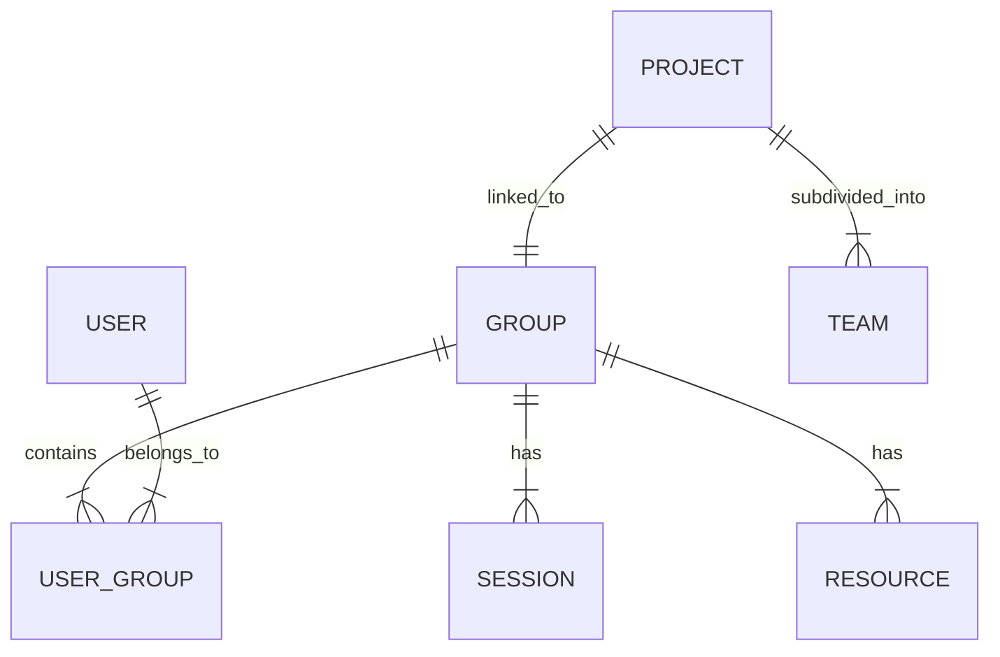

# Spécifications : Gestion des Groupes d'Apprenants 🧑🤝🧑

**Priorité** : P0 (Cœur du système)
**Statut** : À spécifier techniquement

Ce module est la colonne vertébrale d'Ateliers 360. Il permet d'organiser les apprenants en entités logiques pour le suivi pédagogique et l'organisation.

## 1. Concepts Clés

* **Groupe** : Une entité permanente (ex: "Classe CM2 B", "Club Robotique Mercredi").
* **Session/Atelier** : Un événement ponctuel ou récurrent rattaché à un groupe.
* **Sous-groupe** : Division temporaire pour un projet spécifique (ex: "Équipe Projet 1").

## 2. Fonctionnalités Détaillées

### A. Gestion Structurelle (CRUD)

* [ ] **Création de groupes**
  * Attributs : Nom, Niveau (Débutant, Intermédiaire, etc.), Tranche d'âge, Établissement de rattachement, Thématique principale.
  * Tags/Labels pour filtrage rapide.
* [ ] **Composition**
  * Ajout d'apprenants (par sélection ou import CSV).
  * Assignation d'un ou plusieurs animateurs référents.
  * Gestion des rôles internes (Délégué, Chef d'équipe - optionnel).
* [ ] **Historique**
  * Archivage des groupes en fin de cycle (ne pas supprimer les données).
  * Accès à l'historique des activités passées.

### B. Organisation & Planning

* [ ] **Calendrier Partagé**
  * Vue "Planning Groupe" : Liste des prochaines sessions.
  * Gestion des récurrences (ex: "Tous les mercredis 14h").
* [ ] **Présence & Assiduité**
  * Feuille d'appel numérique (Interface Animateur simple et rapide).
  * Statuts : Présent, Absent, Retard, Excusé.
  * Notification automatique aux parents/admin en cas d'absence (configurable).

### C. Contenus Pédagogiques Associés

* [ ] **Bibliothèque de Groupe**
  * Espace fichiers partagés (PDFs, images).
  * Liens utiles (Vidéos, Docs externes).
* [ ] **Progression Pédagogique**
  * Déblocage de contenus : Le contenu devient visible à une date donnée ou après validation d'un module.
  * Association de contenus spécifiques à des sous-groupes (différenciation pédagogique).

### D. Suivi Pédagogique (LMS Light)

* [ ] **Tableau de bord Apprenant**
  * Vue individuelle de progression.
  * Compétences acquises vs à acquérir.
* [ ] **Évaluation**
  * Notes d'observation de l'animateur (privé ou partagé).
  * Auto-évaluation de l'apprenant (ex: Smileys ou jauge de confiance sur une compétence).
  * Feedback qualitatif (audio/texte).

### E. Projets & Ateliers Pratiques

* [ ] **Mode Projet**
  * Définition d'un "Projet Fil Rouge" pour le groupe.
  * Découpage en étapes/milestones.
  * Livrables attendus.
* [ ] **Journal de Bord**
  * Upload de photos des réalisations par les apprenants ou l'animateur.
  * Portfolio généré automatiquement en fin de projet.

## 3. Modèle de Données (Draft)

## 4. Priorités d'Implémentation (MVP)

1. Création Groupe + Assignation Utilisateurs.
2. Planning/Calendrier simple.
3. Feuille de présence.
4. Partage de fichiers simple.
