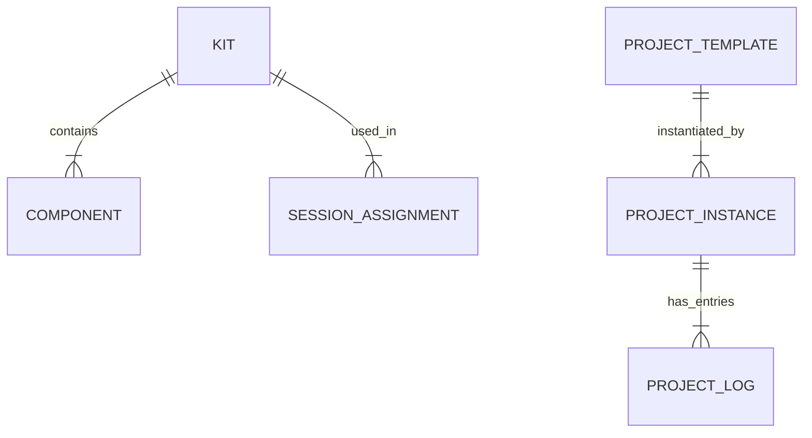

# Spécifications : Pôle 1 – Robotique & Automatismes 🤖

**Objectif Pédagogique** : Apprendre par la manipulation, le concret et la physique (Lien direct GEII).
**Philosophie** : "Faire pour comprendre."

## 1. Fonctionnalités Clés

### A. Gestion des Kits Matériels (Inventory & Assignment)

* [ ] **Catalogue Matériel**
  * Types supportés : Arduino, mBot, LEGO Spike/Mindstorms, Bras robotiques, Composants (Capteurs, LEDs, Moteurs).
  * État du matériel : Neuf, Bon, Usé, Hors-Service.
* [ ] **Gestion de Parc**
  * Assignation : "Kit #4" assigné à "Binôme A" pour la séance.
  * Check-in / Check-out avec scan rapide (douchette ou QR Code caméra smartphone) pour vérifier le retour complet.
* [ ] **Alertes Maintenance**
  * Signalement rapide par l'élève ou l'animateur ("Moteur Kit #2 HS").

### B. Fiches Projets Techniques

* [ ] **Structure Structurée** (pour habituer à la rigueur ingénieur)
  * Objectif (ex: "Fabriquer un feu tricolore").
  * Schéma électronique simplifié (interactive viewer ou image).
  * Liste composants requis (BOM - Bill of Materials).
  * Étapes de montage pas-à-pas.
  * Code de base (snippet à copier ou télécharger).
* [ ] **Validation**
  * Critères de réussite ("La LED rouge s'allume 3s, puis la verte...").

### C. Journal de Projet Technique

* [ ] **Documentation**
  * Upload photos montage en cours.
  * Champ "Notes techniques" : Problèmes rencontrés (ex: "Faux contact sur la breadboard").
  * Champ "Solutions trouvées".
* [ ] **Collaboratif**
  * Accessible par le binôme/groupe projet.

### D. Suivi des Compétences (GEII Oriented)

* [ ] **Référentiel Compétences**
  * Élec : "Sait lire un schéma", "Sait câbler une LED dans le bon sens".
  * Autom : "Comprend la boucle de rétroaction", "Sait programmer une condition IF".
* [ ] **Validation**
  * Par l'animateur (observation directe).
  * Par QCM technique rapide en ou fin de séance.

## 2. Modèle de Données Spécifique (Draft)

## 3. Priorités

1. Fiches Projets numérisées (Pour guider l'autonomie).
2. Gestion simple des Kits (Qui a quoi ?).
